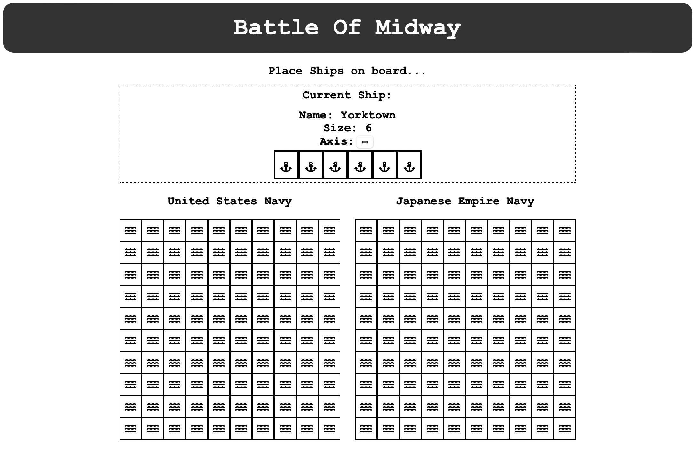

# Battleship-React

Battleship web game - themed on the WW2 Battle Of Midway!

Battleship is a strategy type guessing game for two players. It is played on ruled grids on which each player's fleet of ships (including battleships) are marked. The locations of the fleets are concealed from the other player. Players alternate turns calling "shots" at the other player's ships, and the objective of the game is to destroy the opposing player's fleet.



### Live Demo

[GitHub Pages](https://rcamach7.github.io/battleship-react/).

### Built Using:

- React Framework
  - lifecycle methods
  - class components
  - functional components
  - state management
  - event handlers
- Javascript
- [FontAwesome Toolkit](https://fontawesome.com)
- HTML
- CSS

#### Local Installation & Running

```bash
git clone https://github.com/rcamach7/battleship-react.git
cd battleship-react
npm install
npm run start
```
